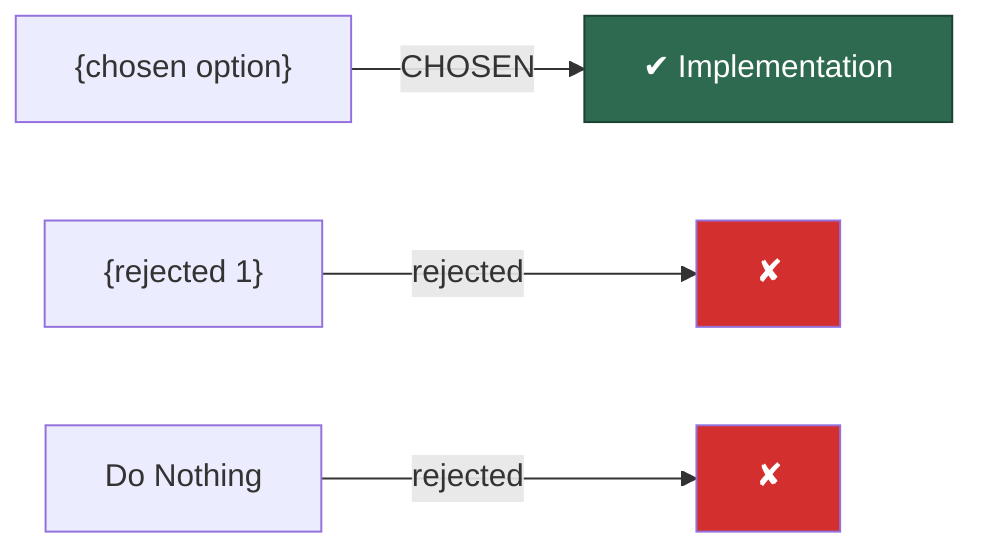

# ADR Template — Nygard Format

Original Michael Nygard format (5 sections). Used when `adr_format` is `nygard`.

Reference: <https://cognitect.com/blog/2011/11/15/documenting-architecture-decisions>

---

## Template

```markdown
# {NEXT_ADR_NUMBER}. {title}

Date: {YYYY-MM-DD}

## Status

Proposed

{If SUPERSEDES_ADR:}
Supersedes ADR-{N}: {old_title}

## Context

{Problem statement, forces at play, constraints, and decision drivers — combined into narrative form. Describe the situation neutrally. These forces are probably in tension.}

{If SUPERSEDES_ADR:}
This decision revisits ADR-{N}: {old_title} because {reason for supersession}.

Decision-makers: {DECISION_MAKERS — from git contributor analysis + user confirmation}

## Decision

> **We will {chosen_option_description}.**

{Justification with evidence references. Full sentences, active voice. Reference specific decision drivers and evidence that support this choice.}



We considered and rejected:
- **{rejected_option_1}**: {reason with evidence reference}
- **{rejected_option_2}**: {reason with evidence reference}
- **Do Nothing**: {reason or acknowledgment of current state trajectory}

## Consequences

**Positive:**
- {consequence — what becomes easier or better}

**Negative:**
- {consequence — what becomes harder or worse}

**Risks:**
- {risk}: {mitigation strategy}
```

---

## Notes

- Nygard format is intentionally minimal — one to two pages maximum
- Conversational style; the audience is "future developers"
- Store under `doc/adr/adr-NNN.md` by convention
- Once accepted, never reopen — supersede instead
