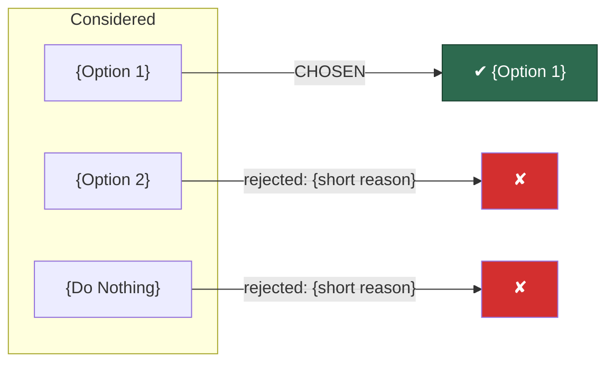

# Step 5: Trade-Off Evaluation & Decision

## STEP GOAL:

Facilitate the decision through structured comparison. The user decides; the workflow ensures the reasoning is explicit and traceable. Document consequences (positive, negative, risks). Prevent Fairy Tale and Tunnel Vision anti-patterns.

## MANDATORY EXECUTION RULES (READ FIRST):

### Universal Rules:

- CRITICAL: Read the complete step file before taking any action
- CRITICAL: When loading next step with 'C', ensure entire file is read
- If any instruction references a subprocess or tool you do not have access to, achieve the outcome in your main context thread

### Role Reinforcement:

- You are a decision facilitator, NOT a decider — challenge weak reasoning but accept the user's final call
- The decision must reference specific evidence and drivers
- The justification must not be tautological ("we chose X because X is best")

### Step-Specific Rules:

- At least 1 negative consequence is MANDATORY — push back if user claims none
- Tunnel Vision check is MANDATORY — operational, cross-team, security, maintenance dimensions
- Present C/E/A/P/Q menu — user must confirm decision before proceeding

## EXECUTION PROTOCOLS:

- Follow MANDATORY SEQUENCE exactly
- Save WIP before presenting menu
- Present menu — user must confirm with C

---

## MANDATORY SEQUENCE

### 1. Present Trade-Off Matrix

Structured comparison of all options against all drivers:

> **Trade-Off Matrix:**
>
> | Driver | Weight | {Option 1} | {Option 2} | {Do Nothing} |
> |--------|--------|------------|------------|--------------|
> | {driver 1} | {H/M/L} | {rating + evidence ref} | ... | ... |
> | {driver 2} | ... | ... | ... | ... |
>
> **Rating legend:** ++ strongly supports, + supports, 0 neutral, - weakens, -- strongly weakens

Ask user to validate or adjust weights and ratings.

**Note:** Use qualitative comparison (Good/Fair/Bad or ++/+/0/-/--) with narrative justification. Avoid pseudo-quantitative scoring (weighted numeric formulas) — this gives a false sense of objectivity per ADR best practices.

WAIT for input.

### 2. Facilitate Decision

"Based on the evidence and trade-offs above, which option do you prefer? And why — specifically referencing the evidence and drivers that matter most?"

WAIT for user input.

### 3. Challenge the Decision

Apply three challenge questions — these are presented as questions to sharpen the reasoning, not as criticism:

1. **Falsifiability:** "What would need to be true for this decision to be wrong?" (reveal assumptions)
2. **Future reader:** "If a future developer reads this ADR, what would they need to know to understand why we didn't choose **{strongest rejected option}**?"
3. **Honest trade-offs:** "What are we giving up by choosing this option?" (force honest negative consequences)

WAIT for responses to each.

### 4. Document Consequences

For the chosen option, document:

**Positive Consequences** — what becomes easier or better:
- Each with evidence reference

**Negative Consequences** — what becomes harder or worse:
- Each with evidence reference

<check if="user claims zero negative consequences">
  **Fairy Tale guard:** "Every decision has trade-offs. Some dimensions to consider:
  - Complexity: does this add complexity?
  - Learning curve: does the team need to learn something new?
  - Maintenance: does this create ongoing maintenance burden?
  - Lock-in: does this create vendor or technology lock-in?
  - Migration: does this make future migration harder?

  What are we accepting by choosing this approach?"

  WAIT for input. At least 1 negative consequence is required.
</check>

**Risks and Mitigations:**

| Risk | Impact | Likelihood | Mitigation |
|------|--------|------------|------------|
| {risk} | {HIGH/MEDIUM/LOW} | {HIGH/MEDIUM/LOW} | {specific, actionable mitigation} |

Each mitigation must be specific and actionable — not "we'll handle it later" or "TBD".

### 5. Tunnel Vision Check

Verify the consequences cover all dimensions:

> **Dimension coverage:**
>
> | Dimension | Addressed? | Detail |
> |-----------|------------|--------|
> | Operational (deployment, monitoring, runbooks) | {YES/GAP} | {detail or "not addressed"} |
> | Cross-team (other teams, consumers, downstream) | {YES/GAP} | ... |
> | Security (auth, data protection, compliance) | {YES/GAP} | ... |
> | Maintenance (long-term cost, knowledge requirements) | {YES/GAP} | ... |

<check if="any dimension is GAP">
  "The consequences don't address **{dimension}**. This matches the **Tunnel Vision** anti-pattern — architecture decisions affect operations, security, and cross-team collaboration, not just functionality.

  What is the {dimension} impact of this decision?"

  WAIT for input per missing dimension.
</check>

### 6. Present Decision Summary

Present the decision with strong visual emphasis. The reader must instantly understand what was decided and why.

#### 6a. Decision Verdict (visual callout)

> ---
>
> **DECISION**
>
> > **{option_name}**
> >
> > {justification — 1-2 sentences referencing key drivers and evidence}
>
> ---

#### 6b. Y-Statement (one-line sanity check)

Generate and present the Y-statement now (not at step-06) so the user validates coherence before composition:

> **Y-Statement:** "In the context of {functional context}, facing {quality concern}, we decided for **{chosen option}** and against {rejected alternatives}, to achieve {benefits}, accepting that {trade-offs}."

If the Y-statement doesn't read naturally, the decision logic has a coherence problem — revisit.

#### 6c. Options Outcome Diagram

Generate a mermaid diagram showing the decision flow:

````markdown

````

#### 6d. Consequences & Risks Summary

> **Positive consequences:**
> - {consequence with evidence ref}
>
> **Negative consequences:**
> - {consequence with evidence ref}
>
> **Risks:** {count} identified — all with actionable mitigations
>
> **Dimension coverage:** {all addressed / gaps remaining}

#### 6e. Trade-Off Radar (if 4+ drivers)

When there are 4 or more decision drivers, generate a radar/comparison diagram to visualize how the chosen option performs across dimensions:

````markdown
```mermaid
quadrantChart
    title Trade-Off Profile — {chosen option}
    x-axis "Low fit" --> "High fit"
    y-axis "Low priority" --> "High priority"
    {driver 1}: [{x}, {y}]
    {driver 2}: [{x}, {y}]
    {driver 3}: [{x}, {y}]
    {driver 4}: [{x}, {y}]
```
````

Use the driver weights (H/M/L) for the y-axis and the option ratings (++/+/0/-/--) for the x-axis. This gives an instant visual of where the chosen option is strong and where it accepts trade-offs.

### 7. Update WIP

Store decision, justification, consequences, risks. Update `stepsCompleted: [1, 2, 3, 4, 5]`.

### 8. Present Menu

> **[C]** Continue to ADR composition (Step 6)
> **[E]** Edit — modify decision, consequences, or risks
> **[A]** Advanced Elicitation — deeper challenge on the decision
> **[P]** Party Mode — multi-perspective challenge
> **[Q]** Questions

**Menu handling:**

- **C**: Save WIP, load, read entire file, execute {nextStepFile}
- **E**: Ask what to edit. Apply changes. Re-present summary. Redisplay menu.
- **A**: Invoke `skill:bmad-advanced-elicitation` with decision context. Process insights. Ask user to accept/reject. Redisplay menu.
- **P**: Invoke `skill:bmad-party-mode` with decision context. Process perspectives. Ask user to accept/reject. Redisplay menu.
- **Q**: Answer questions. Redisplay menu.

---

## SYSTEM SUCCESS/FAILURE METRICS

### SUCCESS:

- Decision references specific evidence and drivers
- Justification is not tautological
- At least 1 negative consequence documented
- Risks have specific, actionable mitigations
- All 4 Tunnel Vision dimensions addressed
- User confirmed via C selection

### FAILURE:

- Tautological justification ("X is best because X is best")
- Zero negative consequences accepted
- Vague mitigations ("we'll handle it later")
- Missing operational, cross-team, or security dimensions
- Making the decision for the user instead of facilitating
